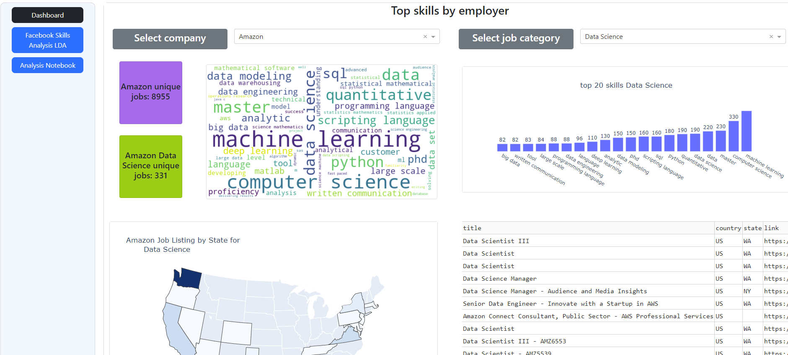
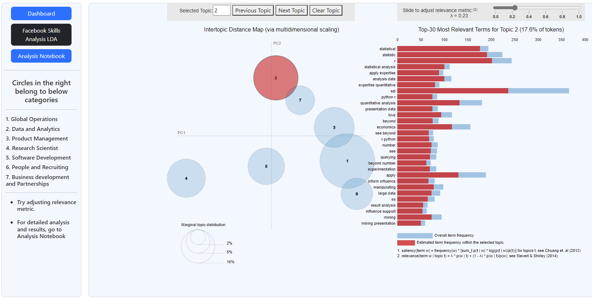

# top-skills-employers-look-for
This repository contains code and snippet for the project on top 20 skills employers look for.

## Files and Directories
- `README.md`: The file that you are reading that describes the files.
- `Data`: Contains data crawled from employers job website. The code to collect the data can be found in python files having crawl name in it.
- `Image`: Folder that stores word cloud file for a particular job category selection in the web application.
- `Screenshots`: Sample png files of web application.
- `Data Preparation.ipynb`: Jupyter notebook having code for preprocess raw data from emoployer's job website.
- `dash_app.py`: Code for dash app that generates the visualization.
- `plotly.py`: Jupyter notebook used for building the dash app visualization.

## Preview
Below is the preview of the dashboard with job category selection of 'Data Science'
> 

Below is the preview of Facebook skills analysis using LDA
> 